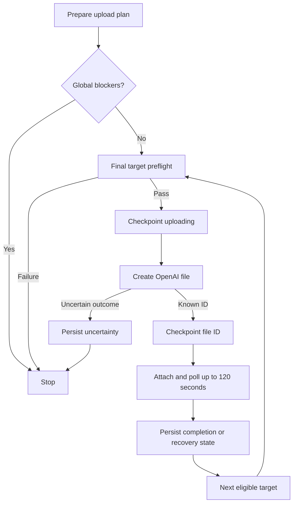
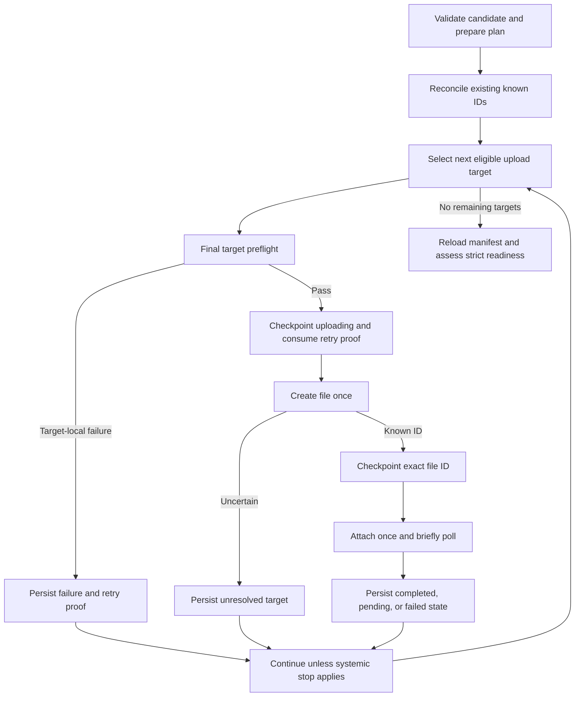

# VDR Assistant MVP 2 — Resilient Ingestion & Recovery Design Report

Date: 2026-09-10  
Task type: Design only

**A. Executive recommendation**

Keep the existing ingestion architecture and add a focused recovery layer:

1. Separate ingestion read retries from mutation retries.
2. Persist retry eligibility and recovery diagnostics on each UploadTarget.
3. Continue after a durably recorded target-local failure.
4. Add reconciliation using persisted OpenAI file IDs.
5. Replace long synchronous indexing waits with short initial polling and later status checks.
6. Keep publication dependent on **100% completion of required searchable targets**.

Manifest v2, worksheet identities, Excel proxies, provenance, snapshot freezing, raw-source protections, and the protected Q&A architecture remain intact.

The smallest coherent change is **an orchestration refinement, a small additive Manifest v2 extension, and a known-ID reconciliation service**. It does not require a database, queue, background worker, parallel ingestion, authentication implementation, or locking implementation.

Two policy choices remain for the next implementation contract: treatment of explicit API rejections, and reattachment after an ambiguous attachment request. Section R identifies them.

This report uses the completed inspection as its baseline. Additional inspection was limited to relevant implementation boundaries, tests, installed SDK behavior, and official API documentation. No code, tests, manifests, artifacts, registry entries, or remote resources were changed. No tests were run; Git status remained clean.

**B. Architecture diagram**

Current behavior:



Proposed behavior:



At every stage, persistence failure, failed checkpoint verification, or candidate-integrity failure stops execution.

The proposed pre-upload reconciliation is a short status sweep. There is no automatic second reconciliation sweep at the end of the same pass.

**C. State-machine design**

Retain the existing literals:

```text
upload_status:
    not_uploaded | uploading | uploaded | failed

indexing_status:
    not_started | in_progress | completed | failed
```

They remain sufficient for upload/indexing progression. They need a small amount of structured recovery metadata to establish retry eligibility and explain unresolved states.

The state names below are **derived classifications**, not new persisted status literals.

| Derived state | Persisted combination | `files.create()` eligible? | Reconcile / attach / poll | Operator action | Blocks registration? | Other targets continue? |
|---|---|---|---|---|---|---|
| Fresh | No ID; `not_uploaded / not_started`; attempts 0; neutral recovery state | Yes, after preflight and checkpoint | No | Continue ingestion | Yes | Yes |
| Local failure, retry proven safe | No ID; `failed / not_started`; valid local retry proof | Yes, in a later operator-started pass | No | Fix local problem; retry | Yes | Yes |
| Explicit API rejection | No ID; `failed / not_started`; valid rejection proof under Section R policy | Yes, in a later operator-started pass | No | Resolve rejection; retry | Yes | Yes, unless systemic pause applies |
| Create in flight or interrupted | No ID; `uploading / not_started`; no retry proof | **No** | No exact-ID reconciliation possible | Inspect diagnostics; await authoritative resolution or rebuild | Yes | Yes, subject to outage threshold |
| Legacy unresolved failure | No ID; `failed / not_started`; no valid proof | **No** | No exact-ID reconciliation possible | Review; do not infer safety from error text | Yes | Yes |
| Uploaded, attachment not started | Known ID; `uploaded / not_started` | **Never** | Read attachment state; first attachment allowed after absence checks | Recover known file | Yes | Yes |
| Indexing pending | Known ID; `uploaded / in_progress` | **Never** | Read and poll | Refresh/recover status | Yes | Yes |
| Attachment outcome uncertain | Known ID; `uploaded / in_progress`; attachment issue recorded, or interrupted checkpoint | **Never** | Read first; no blind attachment retry | Recover; possibly explicit reattachment under Section H | Yes | Yes |
| Known file not currently attached after a prior attempt | Known ID; `uploaded / in_progress`; absence diagnostic | **Never** | Further reads; explicit reattachment policy applies | Review and attach existing file if allowed | Yes | Yes |
| Remote indexing failed | Known ID; `uploaded / failed`; remote failure diagnostic | **Never** | Read again; no automatic detach/recreate | Resolve remote failure or rebuild candidate | Yes | Yes |
| Remote indexing cancelled | Known ID; `uploaded / failed`; cancellation diagnostic | **Never** | Read again; no automatic restart mutation | Review remote state | Yes | Yes |
| Known underlying file missing | Known ID; `uploaded / failed`; `remote_file_missing` | **Never** | Read-only recheck possible | Restore access/resolve remote resource loss; otherwise rebuild | Yes | Yes, if store/candidate access remains valid |
| Complete | Known ID; `uploaded / completed` | **Never** | Skip ordinary recovery; target remains immutable | Publish when all required targets complete | No, for this target | Yes |
| Invalid or contradictory remote state | Blank ID; no ID with completed indexing; known ID with incompatible upload state; other unsupported combinations | **No** | Diagnostic reads only through a separate inspection path | Resolve state inconsistency | Yes | **Stop if manifest authority is compromised** |

Additional rules:

- A stale or mismatched retry proof never grants upload eligibility.
- A persisted known ID takes precedence over every retry flag, selected UI action, or error message.
- Preprocess workbook parents remain neutral and are never upload candidates.
- Unsupported, ignored, and deliberately excluded sources remain outside the required searchable target set.
- An incomplete Excel generation remains a candidate preparation blocker.
- A sealed snapshot rejects every ingestion/recovery mutation.

The normal transitions are:

```text
Fresh or proven-safe retry
    → checkpoint uploading, remove proof
    → one files.create attempt

    → proven local failure / accepted explicit rejection
        → failed / not_started + durable retry proof

    → ambiguous result
        → uploading / not_started, no proof

    → returned file ID
        → uploaded / not_started, exact ID checkpoint

        → checkpoint attachment intent
            → uploaded / in_progress

            → completed
            → remains in_progress
            → failed
```

Known-ID reconciliation changes only the appropriate target’s remote state. It never returns that target to initial upload eligibility.

**D. Target-local vs systemic failure matrix**

Classification must depend on **operation stage, exception type, and verified context**. Exception text alone is insufficient.

Notation:

- **L:** no ID; `failed / not_started`; valid local retry proof.
- **R:** no ID; `failed / not_started`; valid explicit-rejection proof, if approved under Section R.
- **U:** no ID; `uploading / not_started`; no retry proof.
- **K:** preserve known ID and last established indexing state; attach uncertainty normally remains `in_progress`.
- **F:** known ID; `uploaded / failed`.
- **P:** preserve the last confirmed manifest checkpoint.

“No mutation retry” below means no automatic repetition of the failed POST.

| Failure | Classification | Retry read? | Retry mutation? | Persisted state | Continue pass? | Operator recovery |
|---|---|---|---|---|---|---|
| Local open/read failure proven before SDK invocation | Target-local | N/A | No automatic retry | L | Yes | Restore readability; explicitly retry |
| Stream read failure after entering `files.create()` | Target-local uncertainty | N/A | No | U | Yes, subject to outage threshold | Unknown-ID resolution/rebuild |
| Unsupported extension at a legitimate target’s upload boundary | Target-local | N/A | No | L | Yes | Correct preparation through a valid candidate |
| Raw workbook routed as a direct upload or contradictory artifact path | Candidate/implementation integrity failure | No | No | P | No | Fix invalid state or implementation |
| Source file missing | Target-local if source root remains valid | N/A | No | L | Yes | Restore the reviewed source or rebuild |
| One source’s recorded size no longer matches | Target-local content mismatch | N/A | No | L | Yes | Restore reviewed content; do not update frozen inventory |
| One proxy’s hash or size mismatches | Target-local artifact integrity failure | N/A | No | L | Yes | Restore exact artifact bytes or rebuild |
| Root missing, managed/raw roots overlap, or containment escapes | Candidate-wide | No | No | P | No | Restore valid candidate location/structure |
| Authentication error / HTTP 401 | Systemic | Normally no SDK retry | No | Before target mutation: P; create rejection: R, otherwise U; known ID: K | No; pause | Correct credentials/project configuration |
| Permission error / HTTP 403 | Systemic by default | Normally no SDK retry | No | R/U or K by stage | No; pause | Correct permissions/resource access |
| Transient rate limit / HTTP 429 | Systemic throttling | SDK retries allowed | No | R/U on create; K on known-ID work | Pause on the final surfaced error | Wait until retry time; resume |
| Credit, quota, or spend-limit error | Systemic | No application retry loop | No | R/U or K | No; pause | Resolve account limit |
| API timeout during file creation | Target-local uncertainty, potentially systemic when repeated | N/A | No | U | Yes, until threshold | Never recreate this uncertain target automatically |
| API connection failure during file creation | Same | N/A | No | U | Yes, until threshold | Same |
| HTTP 408 | Transient infrastructure failure; create outcome ambiguous | Yes on GET | No | U or K | Yes, until threshold | Reconcile known ID; unknown ID remains unresolved |
| HTTP 409 | Conflict/ambiguous mutation outcome | Yes on GET | No | U or K | Usually yes; stop if evidence shows candidate ownership conflict | Read attachment state; inspect conflict |
| HTTP 5xx | Transient infrastructure failure; create outcome ambiguous | Yes on GET | No | U or K | Yes, until threshold | Resume safe work after service recovery |
| `BadRequestError` concerning one file’s content/format | Target-local if specifically established | Normally no | No | R under approved rejection policy; otherwise U | Yes | Resolve target problem without changing frozen identity |
| `BadRequestError` concerning shared request configuration | Systemic | Normally no | No | R/U or K | No | Fix request construction/configuration |
| Unclassified `BadRequestError` | Systemic until cause is understood | Normally no | No | R/U or K | No | Inspect structured diagnostics |
| Missing, blank, or unusable returned file ID | Target-local protocol uncertainty | N/A | No | U | Yes, until threshold | Unknown-ID resolution/rebuild |
| Attachment POST timeout/connection failure | Target-local known-ID uncertainty | Subsequent GETs: yes | No | K, normally `in_progress` | Yes, until threshold | Read exact attachment before any further POST |
| Attachment response carries wrong file/store ID | Candidate/remote identity inconsistency | No automatic recovery | No | P with known ID preserved | No | Investigate mismatch |
| Polling GET timeout | Target-local recoverable read failure after SDK retries | Yes | None needed | K | Yes, until threshold | Refresh later |
| Polling GET connection failure | Same | Yes | None needed | K | Yes, until threshold | Refresh later |
| Initial polling window expires with `in_progress` | Target-local pending work; **not a failure** | Later reads allowed | No | `uploaded / in_progress` | Yes | Refresh later |
| Remote indexing `failed` | Target-local terminal observation | Later explicit read allowed | No automatic restart | F | Yes | Inspect remote error; resolve or rebuild |
| Remote indexing `cancelled` | Target-local terminal observation | Later explicit read allowed | No automatic restart | F | Yes | Inspect cancellation |
| Unknown/malformed remote status | Target-local protocol issue initially | Later read allowed | No | K; do not invent completion/failure | Yes, until threshold | Refresh; inspect repeated protocol errors |
| Exact attachment lookup returns 404 | Absence observation, not automatically systemic | Confirmation reads allowed | Only through Section H algorithm | Preserve known ID | Yes | Check store and underlying file |
| Underlying known file returns 404 while store is accessible | Target-local remote resource loss | Later explicit read allowed | **No new file creation** | F | Yes | Resolve resource loss or rebuild |
| Vector store missing/inaccessible or mismatched | System/candidate failure | Transient reads only where appropriate | No | P/K | No | Restore correct access/store; never silently reassociate |
| Manifest save failure | Systemic integrity failure | N/A | No further mutation | P | **No** | Restore persistence; inspect exact checkpoint |
| Manifest reload/verification failure | Systemic integrity failure | N/A | No further mutation | P | **No** | Establish authoritative persisted state |
| Candidate identity or frozen-content mismatch | Candidate-wide | No | No | P | **No** | Reload/review correct candidate |
| Unexpected application exception outside a known remote boundary | Systemic implementation failure | No generic retry loop | No | P | No | Inspect implementation error |

A proxy byte mismatch is local only when the manifest’s generation identity, coverage, path ownership, and surrounding candidate structure remain valid. Corrupt generation metadata is a candidate-integrity problem.

The official error guide distinguishes authentication, permission, throttling, and billing failures; it also advises inspecting structured error codes for billing conditions. These distinctions should drive orchestration, rather than treating every `RateLimitError` as a short-lived throttle. [OpenAI error codes](https://developers.openai.com/api/docs/guides/error-codes)

The minimal systemic policy should be:

- **Immediate pause:** authentication, permission, quota/billing, inaccessible store, or a surfaced rate limit.
- **Immediate stop:** persistence, verification, identity, freeze, or structural integrity failure.
- **Pause after three consecutive infrastructure-failed targets:** exhausted transport/server errors or malformed remote responses.
- A target with a successful file creation followed by attachment failure counts as an infrastructure-failed target.
- A successfully established terminal or pending remote state resets the streak.
- Local preflight failures neither increment nor reset it.
- Preliminary store-health reads do not reset target failure streaks.

This is a small counter within a pass, not a circuit-breaker subsystem. Resetting it after restart cannot authorize a duplicate upload; target eligibility remains durable.

**E. Retry policy**

Introduce an ingestion-specific policy module. Leave the shared Q&A client factory unchanged.

| Operation | Automatic SDK retries | Proposed request timeout | Application behavior |
|---|---:|---|---|
| `files.create()` | **0** | Retain current 600-second timeout, connect 5 seconds | One attempt per selected eligible target |
| `vector_stores.files.create()` | **0** | 30 seconds, connect 5 seconds | One attachment attempt; reconcile ambiguity |
| `vector_stores.create()` | **0** | Preserve existing timeout unless separately changed | Preserve existing creation safeguards |
| Vector-store retrieve/list | **2** | 5 seconds per HTTP phase | Stop/pause appropriately if exhausted |
| Underlying file retrieve | **2** | 5 seconds per HTTP phase | Validate exact returned ID |
| Attachment retrieve/status polling | **2** | 5 seconds per HTTP phase | Preserve known ID if exhausted |
| Paginated ingestion reads | **2 per request/page** | Same read policy | Do not treat partial pagination as complete evidence |

Use explicit clones:

```text
mutation_client(base_client)
    → max_retries=0

read_client(base_client)
    → max_retries=2
```

Configure request-specific timeouts separately. Neither helper mutates the original client.

The installed SDK’s two-retry policy covers transport failures and ordinarily HTTP 408, 409, 429, and 5xx, with backoff and server retry-header handling. The application should not add another retry loop around exhausted SDK reads.

The exact adjustment points are:

- Replace the shared zero-retry helper in `src/ingestion/uploader.py`.
- Separate attachment mutation from polling.
- Route ingestion reads in `src/ingestion/vector_store_manager.py` through the read policy.
- Use the same read policy in the new reconciliation service.
- Keep the production Q&A factory and retrieval policy unchanged.

For file creation, a **later operator-started safe retry** is distinct from an automatic SDK retry. Section K defines its eligibility.

**F. Uncertain-create behavior**

Two successful-persistence early-return branches in `run_manifest_upload()` become continuation paths:

1. The generic exception branch around `upload_file(...)`.
2. The branch where the returned object lacks a usable file ID.

Both currently build a critically stopped result and return. The replacement is:

```text
Classify the error
    → persist uncertainty and structured diagnostic
    → verify the exact target checkpoint
    → append target outcome
    → emit target-level progress
    → apply systemic pause/stop policy
    → otherwise continue
```

The corresponding checkpoint-failure branches must still stop immediately.

Do not implement this as an unconditional textual replacement of `return` with `continue`: authentication, rate limits, outage thresholds, and persistence failure require different behavior.

For uncertainty:

```text
openai_file_id = None
upload_status = uploading
indexing_status = not_started
retry proof = absent
```

The result accumulates every unresolved target. Multiple isolated uncertainties do not automatically invalidate progress on unrelated targets.

“Needs recovery” should remain a **target classification and aggregate count**, rather than implying that the whole pass stopped.

Example:

> Ingestion pass finished. 82 targets completed, 2 are still indexing, and 2 have unresolved upload outcomes. The case is not ready to publish.

An ambiguous create can still make that candidate impossible to publish without authoritative recovery or rebuilding. Continuing the pass maximizes progress; it does not resolve the ambiguous target.

**G. Known-ID reconciliation design**

Add a first-class service with these boundaries:

```text
reconcile_known_targets(...)
    → selects persisted known-ID incomplete targets

reconcile_known_target(...)
    → applies one target’s recovery algorithm

inspect_attachment(...)
    → read-only exact store/file lookup

attach_known_file_once(...)
    → attachment POST only

poll_known_attachment(...)
    → read-only polling

checkpoint_target_transition(...)
    → shared manifest save/read-back verification
```

The reconciliation module should have **no dependency on `upload_openai_file()`**. Tests should fail immediately if `files.create()` is reached through any recovery path.

Recommended algorithm:

1. Load the manifest from durable storage.
2. Verify ownership, preparing state, frozen candidate identity, and exact UploadTarget key.
3. Require a usable persisted file ID and a supported remote-state combination.
4. Skip completed targets.
5. Retrieve and validate the candidate vector store once for the recovery pass.
6. Retrieve the exact attachment:

   ```text
   vector_stores.files.retrieve(
       file_id,
       vector_store_id=manifest.vector_store_id
   )
   ```

7. Validate both returned identifiers before accepting status.
8. Apply the observed state:

   | Remote observation | Action |
   |---|---|
   | `completed` | Persist `uploaded / completed`; clear recovery issue and error |
   | `in_progress` | Persist/retain `uploaded / in_progress`; optionally perform bounded polling |
   | `failed` | Persist `uploaded / failed` with sanitized remote error code |
   | `cancelled` | Persist `uploaded / failed` with cancellation code |
   | Absent | Follow Section H |
   | Read error | Preserve known ID and last established status; persist recovery diagnostic |

9. Verify the checkpoint before reporting durable success.
10. Continue to the next target unless the systemic policy stops the pass.

The API exposes an exact attachment endpoint and returns the attachment’s file ID, vector-store ID, status, and last error. This supports identity-based reconciliation without filename matching. [Retrieve vector store file](https://developers.openai.com/api/reference/resources/vector_stores/subresources/files/methods/retrieve)

Recovery must not require opening the original document or rehashing an already-uploaded Excel proxy. The manifest and persisted file ID are the recovery identity. This preserves recovery when local source files are temporarily unavailable.

Checkpoint ordering for a new attachment remains:

```text
Known file ID already saved and verified
    → checkpoint indexing in_progress
    → one attachment POST
    → validate response
    → bounded read polling
    → checkpoint observed result
```

A recovery operation that only reads remote completion needs no “attachment intent” checkpoint; it saves the verified completion directly.

Execution entry points:

- **Continue ingestion:** one initial known-ID reconciliation sweep, then new/safely retryable uploads.
- **Refresh and recover known files:** explicit operator action using the same service, without creating new OpenAI files.
- **Ordinary page rendering:** local reads only.
- **No automatic post-upload sweep:** it adds repeated reads and waiting; the next explicit recovery action can perform it.

Existing attachments already `in_progress` receive one status lookup during the initial sweep, without a per-target waiting window.

**H. Attachment ambiguity design**

The attachment endpoint accepts an existing file ID, so repeating an attachment operation has a different risk from creating another OpenAI File object. Nevertheless, its documented request shape does not establish a transactional “attach if absent” guarantee. [Create vector store file](https://developers.openai.com/api/reference/resources/vector_stores/subresources/files/methods/create)

Use three cases.

| Situation | Recommended behavior |
|---|---|
| Exact attachment exists | Never POST again; use returned status |
| Exact attachment absent and local state proves attachment never started | Verify underlying file and store, then perform the first attachment |
| Exact attachment absent after a prior/uncertain attachment attempt | Do not automatically reattach |

For absence:

1. Distinguish the attachment’s 404 from inaccessible or missing parent resources.
2. Verify the vector store exists and returns the expected ID.
3. Verify the underlying file exists and returns the persisted ID.
4. For a previously attempted attachment, perform a second exact attachment lookup after a short delay.
5. If either read finds the attachment, reconcile it.
6. If absence persists, present the explicit recovery option described below.

**A repeated 404 establishes observed absence, not proof that an earlier request cannot commit later.** The inspected documentation does not settle that consistency question. Listing the store does not remove this limitation, and a partial list is especially unsuitable as absence evidence.

Recommended operator option:

> Attach the existing OpenAI file to this case’s vector store.

Before performing it, the service repeats the exact reads, revalidates the candidate and target, checkpoints attachment intent, and issues one zero-retry POST using the **same persisted file ID**.

This is an explicit, read-informed reattachment, with a disclosed residual late-commit ambiguity. It does not create another File object or change citation identity. Whether to include it in this milestone is the second decision in Section R.

Do not:

- Match unknown files by filename.
- Clear or replace the known ID.
- Automatically delete failed attachments.
- Automatically detach and reattach terminal failures.
- Treat a failed GET as evidence of absence.

**I. Polling design**

Recommended defaults:

| Setting | Proposal |
|---|---|
| Initial polling window after a new attachment | **10 seconds** |
| Attachment POST timeout | 30 seconds |
| Read timeout | 5 seconds per HTTP phase |
| Read SDK retries | 2 |
| Healthy polling intervals | 2 seconds, then 4 seconds, then up to 8 seconds |
| Existing pending targets during a reconciliation sweep | One status lookup; no synchronous wait |
| Window expiry | Normal pending outcome |
| Terminal statuses | `completed`, `failed`, `cancelled` |
| Later progress | Explicit reconciliation action or next ingestion pass |

The 10 seconds is a **poll-scheduling window**, not a guaranteed wall-clock deadline. A synchronous SDK request can exceed it while completing its allowed retries, particularly when honoring a server retry delay.

The implementation must check the remaining window before sleeping and before starting another logical GET. It should let an already-started SDK call finish and then stop scheduling more polls.

A hard deadline that interrupts SDK retry handling would require a different cancellation/transport design. That is unnecessary for this milestone and should not be implied by the UI.

When the window expires:

```text
upload_status = uploaded
indexing_status = in_progress
known ID preserved
diagnostic = initial_poll_window_elapsed
```

This outcome:

- Does not increment the outage counter.
- Does not mark indexing failed.
- Does not trigger another attachment.
- Allows the next upload target to proceed.

Retaining a longer upload request timeout avoids creating additional ambiguous uploads merely to shorten the indexing wait.

**J. Durable recovery-state design**

Existing fields plus a better `last_error` string are insufficient. Human-readable text cannot safely establish that a request never began, remain reliably machine-classifiable, or bind retry eligibility to a specific attempt.

Recommend one optional additive field on `RemoteState`:

```text
recovery: TargetRecovery | None = None
```

Proposed structure:

```text
TargetRecovery
    stage:
        local_preflight
        file_create
        attachment
        polling
        reconciliation

    code: controlled application diagnostic code
    recorded_at: UTC datetime

    http_status: integer | None
    api_error_code: string | None
    request_id: string | None
    retry_after_at: UTC datetime | None

    create_retry_proof: CreateRetryProof | None
```

Retry proof:

```text
CreateRetryProof
    candidate_fingerprint: string
    source_relative_path: string
    artifact_id: string | None
    upload_attempt: nonnegative integer
    basis:
        local_before_request
        explicit_api_rejection
```

The second basis is included only if Section R’s rejection policy is accepted.

Use controlled diagnostic codes such as:

```text
source_missing
source_unreadable
source_metadata_mismatch
invalid_extension
proxy_integrity_mismatch
local_upload_open_failed
api_rejected
authentication_failed
permission_denied
rate_limited
quota_blocked
create_outcome_unknown
missing_returned_file_id
attachment_outcome_unknown
attachment_absent
remote_file_missing
read_timeout
read_connection_failed
remote_service_error
initial_poll_window_elapsed
remote_indexing_failed
remote_indexing_cancelled
unexpected_remote_response
```

`last_error` remains a short sanitized explanation. Never parse it for eligibility.

Do not add independent persisted `retry_eligible` or `remote_outcome` flags. They are derivable from the existing tuple, known ID, and validated proof. Persisting several overlapping authority flags would create unnecessary contradictory states.

Required integration rules:

- Add `recovery` to the remote fields excluded from frozen-content comparison.
- Exclude it from the candidate’s frozen-content digest.
- Require workbook parents to have `recovery=None`.
- Clear recovery data when successfully completing a target.
- Preserve completed-target immutability.
- Reject malformed proof structures.
- Validate proof ownership against candidate, target, and current attempt before use.

There is an important Excel serialization dependency: `generation.json` currently includes serialized worksheet artifact models. Adding a `RemoteState` field would otherwise alter that metadata.

**Explicitly exclude `recovery` from generation metadata serialization.** Existing generation IDs, artifact IDs, proxy bytes, and immutable generation metadata must remain equivalent. Recovery updates belong only in the manifest.

Compatibility:

- Existing Manifest v2 documents load with `recovery=None`.
- Do not rewrite sealed manifests to backfill fields.
- Legacy no-ID failures without proof remain unresolved.
- Legacy known-ID incomplete targets can use reconciliation.
- Do not infer durable proof from historical error wording.

This extension stores the latest actionable recovery information, not a complete operation audit log.

A returned file ID whose checkpoint fails remains an exceptional limitation: if persistence is unavailable, no manifest extension can guarantee saving it. Stop immediately, retain the exact ID in available diagnostics, and never claim it was durably recorded.

**K. Safe-retry design**

Choose **durable manifest evidence with eligibility derived from that evidence**: options A and B from the handoff.

The proof replaces session-only safety authority. Streamlit state may remember selected rows and display preferences, but it cannot authorize a retry.

Eligibility requires all of:

```text
No known file ID
    AND upload_status = failed
    AND indexing_status = not_started
    AND valid retry proof
    AND proof matches current candidate fingerprint
    AND proof matches exact UploadTarget key
    AND proof matches upload_attempts
    AND current candidate remains mutable and structurally valid
    AND final preflight passes
```

The fingerprint should cover the existing candidate context:

- Resolved VDR root.
- Resolved manifest location.
- Vector-store ID.
- Frozen manifest identity, including creation identity and Excel generation content.

Before another create attempt:

1. Reload the current manifest.
2. Revalidate the selected candidate and exact proof.
3. Run final preflight.
4. Increment the attempt counter.
5. Clear the proof.
6. Set `uploading / not_started`.
7. Save and verify.
8. Only then call `files.create()` once.

If the process stops after step 7, restart sees uncertainty and cannot reuse the consumed proof.

A final preflight failure does not increment the create-attempt counter. A proven local open failure after the uploading checkpoint records proof for that checkpoint’s attempt number.

Selected retries run at most once per operator-started pass. A newly safe-retryable failure is not immediately looped back into the same pass.

The recommended explicit-rejection policy is narrow:

- Accept a structured API rejection from the single zero-retry request for HTTP **400, 401, 403, 413, 415, or 429**.
- Treat it as evidence that the attempted request was rejected.
- Require a later explicit operator-started retry.
- Do not apply this to 408, 409, 5xx, transport exceptions, malformed responses, or missing success IDs.
- Do not infer it from a status embedded in exception text or an unrecognized intermediary response.

This is a proposed application interpretation of received rejection responses, not a documented exactly-once guarantee. It broadens the prior local-only proof rule and therefore needs the explicit decision identified in Section R.

**L. Batch-result/UI design**

Separate three concepts:

1. What happened during this pass.
2. What the durable candidate currently contains.
3. Whether the candidate is registerable.

Proposed result:

```text
UploadBatchResult
    candidate_context

    pass_outcome:
        finished
        paused
        stopped

    stop_reason: structured reason | None
    target_results: collection keyed by UploadTargetKey

    pass_counts:
        file_create_attempts
        file_ids_checkpointed
        attachment_attempts
        targets_reconciled
        targets_completed
        targets_blocked_locally
        eligible_targets_not_reached

    candidate_counts:
        completed
        pending_upload
        safely_retryable
        uncertain_create
        known_id_pending
        known_id_failed
        unresolved_legacy_or_invalid

    publication_ready: bool
    summary_authoritative: bool
    diagnostics: collection
```

Definitions:

- **Finished:** the pass exhausted its work list, possibly leaving unresolved targets.
- **Paused:** authentication, throttling, quota, or outage policy prevented useful continuation.
- **Stopped:** local/candidate integrity or checkpoint safety failed.
- `publication_ready` comes only from strict readiness on the reloaded manifest.
- If final reload fails, set `summary_authoritative=False`; do not present stale counts as a verified ready state.

Candidate categories must be mutually exclusive. Preflight failures can be shown as a breakdown of safely retryable targets; do not add them again to the total.

Replace the single `recovery_file_id`/`recovery_details` emphasis with a collection. Preserve an explicit diagnostic for an ID returned but not confirmed persisted.

Each diagnostic should identify:

- Candidate and manifest.
- Exact source/artifact key.
- Human-readable source/worksheet label.
- Known file ID, if available.
- Failure stage and code.
- Last confirmed persisted state.
- Permitted next action.

Suggested UI wording:

| Situation | Wording |
|---|---|
| Finished with pending indexing | “Pass finished. 83 of 86 targets completed; 3 are still indexing.” |
| Finished with uncertain creates | “Pass finished with unresolved uploads. Other eligible targets were processed.” |
| Rate-limit pause | “Ingestion paused because OpenAI limited requests. Saved progress is available for the next pass.” |
| Persistence failure | “Ingestion stopped because a checkpoint could not be verified. No further targets were attempted.” |
| Strict readiness blocked | “Case remains in preparation. Every required target must complete before publication.” |

Necessary actions:

- **Continue ingestion**
- **Refresh and recover known files**
- **Retry eligible uploads**, or a clearly labeled retry selection within Continue ingestion
- **Attach existing file**, only for the exceptional reviewed case in Section H
- **Reload local summary**, if retaining the existing local-only action

Do not label a local reload as an OpenAI status refresh.

After restart, reconstruct the candidate summary and available actions from the manifest. Exact historical pass counts may disappear with the process; they are presentation data, not recovery authority. No resumable job cursor is needed because each pass derives work from durable target states.

**M. Strict readiness confirmation**

Keep the current registration predicate:

```text
Valid owned candidate
    AND usable case/store identity
    AND completed or explicitly excluded Excel preprocessing
    AND at least one required searchable target
    AND no classification errors
    AND every required target has a known file ID
    AND every required target has upload_status = uploaded
    AND every required target has indexing_status = completed
```

Therefore:

```text
85 / 86 completed → preparing, not registerable
86 / 86 completed → registerable
```

A finished ingestion pass does not imply readiness.

Do not change the required target set to bypass a failed source after association. Do not introduce partial publication or “Ready with warnings.”

Recovery remains unavailable after sealing. Ordinary case opening and Q&A retain their current behavior; they do not start ingestion reads, rehash proxies, or reconcile remote resources.

The current readiness check remains based on persisted completion. This proposal does not add a continuous guarantee against someone subsequently deleting remote resources.

**N. Shared-Team compatibility review**

| Design choice | Classification | Future implication |
|---|---|---|
| Exact UploadTarget identity and known-ID routing | Works unchanged | Suitable for a centrally operated ingestion service |
| Per-target durable recovery metadata | Works unchanged conceptually | Moves with case persistence |
| Separate read/mutation policies | Works unchanged | Central credentials can use the same operation policies |
| Target-local continuation | Works unchanged | Independent of browser/session ownership |
| Reconciliation service outside Streamlit | Works unchanged | Can later run behind an operator endpoint |
| Strict publication boundary | Works unchanged | Read/Q&A users consume prepared cases |
| Manifest-derived work selection | Works unchanged | No browser-held resume cursor to migrate |
| Absolute-path-bound candidate fingerprints | Needs explicit persistence migration | A move to central paths must deliberately preserve or re-establish proof binding |
| Atomic JSON checkpoint adapter | Needs persistence adaptation if storage changes | Retain transition semantics and verification |
| Session-held progress/result display | Acceptable presentation state | Can be replaced without changing recovery authority |
| Per-pass outage counter | Acceptable transient control | Reset does not change duplicate protection |
| Single-writer rule enforced only operationally | Requires future ownership enforcement | Current code remains unsafe for concurrent writers |
| Shared case registry updates | Requires future shared write coordination | Different-case operators can still collide on the same registry file |

The future case-level ownership boundary must cover preparation, association, upload, recovery, and publication—not merely `files.create()`.

Two existing issues remain separate from per-case ingestion locking:

- Two candidates must not claim the same vector store.
- Concurrent publication of different cases must not lose registry updates.

The current milestone should add no locking mechanism. Its service boundaries should make it straightforward to put future ownership checks around the entire mutating operation.

Recovery metadata is trusted application state, not a signed authorization token or actor audit trail. Future operator identity and audit information can be added without changing target eligibility rules.

**O. File-by-file implementation plan**

Paths are repository-relative. New files below are proposals.

| File | Proposed change | Why / dependencies | Risk |
|---|---|---|---|
| [src/ingestion/manifest.py](<C:/Users/luet087/OneDrive - Bertelsmann SE & Co. KGaA/VDR-Assistant-MVP-2/src/ingestion/manifest.py>) | Add optional recovery models; preserve neutral workbook parents; centralize remote-field exclusions | Foundation for durable classification | Medium: schema and serialization compatibility |
| [src/ingestion/manifest_persistence.py](<C:/Users/luet087/OneDrive - Bertelsmann SE & Co. KGaA/VDR-Assistant-MVP-2/src/ingestion/manifest_persistence.py>) | Exclude recovery from frozen identity; preserve ID/completion guards; support verified recovery transitions | Recovery metadata must remain mutable before sealing | High: checkpoint and freeze correctness |
| `src/ingestion/ingestion_state.py` — new | Candidate fingerprinting, durable eligibility, shared checkpoint helper and target-state interpretation | Prevent upload/recovery implementations from diverging | High: eligibility and stale-state handling |
| `src/ingestion/ingestion_errors.py` — new | Typed stage-aware error classification and simple systemic-stop policy | Separate retry safety from whether the pass should continue | Medium |
| `src/ingestion/openai_policy.py` — new | Read/mutation clones and ingestion timeout constants | Keep ingestion policy independent of Q&A | Low–medium |
| [src/ingestion/uploader.py](<C:/Users/luet087/OneDrive - Bertelsmann SE & Co. KGaA/VDR-Assistant-MVP-2/src/ingestion/uploader.py>) | Split create, attach-once, and polling; retain proven local boundary | Enables reads without repeating POSTs | High: remote mutation boundaries |
| [src/ingestion/vector_store_manager.py](<C:/Users/luet087/OneDrive - Bertelsmann SE & Co. KGaA/VDR-Assistant-MVP-2/src/ingestion/vector_store_manager.py>) | Apply read policy; preserve structured error information and exact-ID validation | Reuse existing store/file retrieval helpers | Medium |
| [src/ingestion/upload_targets.py](<C:/Users/luet087/OneDrive - Bertelsmann SE & Co. KGaA/VDR-Assistant-MVP-2/src/ingestion/upload_targets.py>) | Return typed preflight results; separate logical target lookup from local-file resolution | One missing source must not obstruct known-ID recovery or unrelated targets | Medium |
| [src/ingestion/upload_workflow.py](<C:/Users/luet087/OneDrive - Bertelsmann SE & Co. KGaA/VDR-Assistant-MVP-2/src/ingestion/upload_workflow.py>) | Separate plan blockers from target issues; use durable eligibility; continue local failures; accumulate results; invoke initial reconciliation | Main orchestration change | High |
| `src/ingestion/reconciliation.py` — new | Implement exact-ID recovery and absence/attachment policy | First-class restart recovery | High |
| [src/ingestion/excel_preprocessing.py](<C:/Users/luet087/OneDrive - Bertelsmann SE & Co. KGaA/VDR-Assistant-MVP-2/src/ingestion/excel_preprocessing.py>) | Exclude new recovery field from generation metadata serialization only | Prevent incidental immutable-generation changes | Medium, narrowly scoped |
| [src/ui/new_case_setup.py](<C:/Users/luet087/OneDrive - Bertelsmann SE & Co. KGaA/VDR-Assistant-MVP-2/src/ui/new_case_setup.py>) | Render durable summaries; remove session proof authority; add recovery actions and precise status wording | Expose new service behavior | Medium |
| [scripts/upload_new_manifest_files.py](<C:/Users/luet087/OneDrive - Bertelsmann SE & Co. KGaA/VDR-Assistant-MVP-2/scripts/upload_new_manifest_files.py>) | Use shared recovery/eligibility/result paths; allow recovery when no new upload candidates exist | CLI must not retain the old early-exit limitation | Medium |

The shared checkpoint helper should reload current state before acting, validate the expected candidate and target state, update only that target, and verify the saved result. It must not reuse a stale whole-manifest object across a recovery sweep and subsequent upload loop.

This reduces stale-state errors; it is **not concurrency control**.

No production behavior change is proposed for:

- Excel parser or Markdown serialization.
- Generation/artifact identity algorithms.
- Citation resolver or worksheet provenance.
- Q&A prompt, generation, evidence selection, verification, or release gates.
- Three-call ceiling.
- Readiness predicate or case registration semantics.
- Disabled legacy adoption/reconciliation scripts.

**P. Test plan**

All tests in this section are proposed; none were executed.

**Retry and transport tests**

Use real SDK clients with mock HTTP transports to verify wire-level calls:

- Polling GET: timeout/500 followed by success performs the permitted retry.
- Exhausted GET performs at most three attempts.
- `files.create()` timeout/500 performs exactly one POST.
- Attachment POST timeout/500 performs exactly one POST.
- Vector-store creation still performs exactly one POST.
- A base client’s retry setting remains unchanged.
- Read helpers override a zero-retry base client appropriately.
- Mutation helpers override a retry-enabled base client appropriately.
- Pagination applies read policy to each page.
- Long SDK retry delays do not cause another attachment or file creation.
- Poll-window tests assert scheduling behavior rather than a false hard wall-clock guarantee.

**Continuation tests**

Use at least three targets, with the failure in the middle:

- Target 2 uncertain; target 3 is uploaded.
- Target 2 missing returned ID; target 3 is uploaded.
- Target 2 final preflight fails; target 3 is uploaded.
- Target 2 local open fails; target 3 is uploaded.
- Target 2 proxy hash mismatches; an unrelated valid target is uploaded.
- Target 2 uncertainty checkpoint fails; target 3 is not attempted.
- Returned-ID checkpoint fails; no attachment and no later target.
- Attachment/indexing failure preserves ID and permits target 3.
- Three consecutive infrastructure-failed targets pause before target 4.
- A valid pending/completed target resets the infrastructure streak.
- Auth/permission/quota errors stop further target attempts.
- Local failures do not count toward an outage threshold.
- Preview reports target-local failures without making them global blockers.
- An all-local-failure pass persists diagnostics without constructing an API client.

**Known-ID recovery tests**

For every known-ID state, install a `files.create()` mock that raises immediately:

- Remote completed → local completed.
- Remote in progress → local pending; subsequent refresh can complete it.
- Never-attached known ID + confirmed absence + valid underlying file → one attachment.
- Attachment exists → zero attachment POSTs.
- Lost attachment response followed by visible attachment → read-only recovery.
- One 404 followed by visibility → no reattachment.
- Persistent absence after ambiguity → no automatic reattachment.
- Explicit reviewed reattachment, if approved → exact same file/store IDs.
- Underlying file missing → preserve ID; no reupload.
- Wrong returned file or store ID → systemic stop.
- Remote failed/cancelled → durable failure.
- Unknown remote status → unresolved, never completed.
- Failed GET → not interpreted as absence.
- Sealed target/candidate → no recovery mutation.
- Missing local source/proxy → known-ID recovery still works.
- Legacy inconsistent tuple → no route to file creation.

**Persistence and restart tests**

- Discard all session state, reload manifest, and recover known-ID targets.
- Recreate service objects/process context; local safe retry remains available.
- Candidate/root/store/content changes invalidate proof.
- Copy proof to another target or worksheet; retry is rejected.
- Change attempt counter; retry is rejected.
- A bare target key or fabricated `last_error` cannot authorize retry.
- Proof is removed in the checkpoint before the next create call.
- Interrupt immediately after that checkpoint; restart must classify uncertainty.
- Legacy failed state without proof remains unresolved.
- Failed persistence never yields a claimed durable proof.
- New optional fields do not require rewriting old sealed manifests.
- New metadata cannot bypass completed-target or known-ID guards.

If explicit rejection proof is accepted:

- Each allowlisted structured response grants only a later explicit retry.
- 408/409/5xx and transport failures never grant that proof.
- Unstructured responses and text containing “429” do not grant proof.
- Authentication/rate-limit proof does not bypass the pass pause policy.

**Excel and provenance tests**

- Put the failed worksheet in the middle of three siblings.
- Recover Sheet B; assert Sheet A, Sheet C, workbook provenance, coverage, generation ID, and artifact IDs are unchanged.
- Never call the uploader with `.xlsx` or `.xls`.
- Recovery does not regenerate proxies.
- Adding recovery metadata leaves generation metadata and proxy output equivalent.
- Existing immutable generations remain reusable after a fresh equivalent preprocessing attempt.
- Trusted citation labels remain Workbook → Worksheet.
- Technical proxy filenames never become trusted source labels.
- Citation/evidence replay remains independent of recovery calls and local proxy access.

**Batch-result and readiness tests**

- Several target-local failures accumulate without marking the pass stopped.
- Pending indexing is reported separately from failed indexing.
- Systemic pause and integrity stop are distinct.
- Candidate counts are disjoint and sum to the required target count.
- Reload failure sets `summary_authoritative=False`.
- 85/86 complete remains unregistrable.
- Recovery completing target 86 enables existing registration.
- Recovery metadata does not relax sealing requirements.
- A pass that finishes with unknown-ID uncertainty remains preparing.

**Existing tests requiring changes**

| Existing test/suite | Required adjustment |
|---|---|
| `test_upload_workflow.py::test_generic_upload_failure_is_uncertain_and_stops_later_files` | Replace old stop assertion with continuation; add middle-target failure |
| `test_preparation_reports_every_preflight_blocker` | Assert target-local issues separately from global blockers |
| `test_preparation_blocks_unreadable_file` | Preserve readable diagnostics but remove batch-wide blocking expectation |
| `test_final_preflight_failure_does_not_construct_client` | Preserve no-client behavior for all-local failures; expect durable local failure and normally finished unresolved pass |
| `test_retry_authorization.py` | Replace session-proof authority with durable proof; retain candidate/target/attempt binding and no-ID-override tests |
| `test_excel_upload_targets.py::test_remote_boundaries` | Known-ID restart may now reconcile, while still asserting no `files.create()` |
| `test_sdk_initial_poll_deadline_never_reattaches` | Expect normal pending result at the scheduling limit; retain no-repeat POST assertion |
| `test_three_worksheet_sibling_isolation` | Add a failure in the middle and successful later sibling |
| `test_uploader.py` | Test separate attach and poll boundaries |
| `test_upload_new_manifest_files.py` | Update recovery entry, summaries, and old “no candidates” behavior |
| `test_new_case_setup_ui.py` | Test restart-derived actions and actual remote refresh |
| Manifest/persistence/Excel schema suites | Cover additive field compatibility, proof validation, and frozen metadata exclusions |

Preserve the existing checkpoint-stop, exact returned-ID diagnostics, callback isolation, path containment, raw-workbook rejection, and protected Q&A regression assertions.

Add focused suites for reconciliation, error classification, and durable recovery state rather than concentrating all cases in UI tests.

Manual acceptance after implementation:

| Step | Scenario | Expected result |
|---|---|---|
| A | Small PDF-only case | Upload, bounded indexing checks, later completion if needed, strict registration |
| B | Simulated polling interruption | Read retries recover or preserve a known pending ID; no repeated POST |
| C | Multiple documents with a middle-target failure | Failure remains visible; later valid targets proceed |
| D | Restart after ID checkpoint or interrupted polling | Recovery works without prior browser/session data; zero new file creation for known IDs |
| E | Minimal Excel-only case | Independent worksheet targets, unchanged provenance, no raw workbook upload |
| F | Mixed PDF + Excel case | Direct and worksheet targets follow the same continuation/recovery rules |
| G | Full realistic VDR | Maximum safe progress; pending work recoverable; service outage pauses sensibly |
| H | Final Q&A regression | Published sources resolve correctly; protected answer/evidence behavior and call ceiling remain intact |

Use deterministic fault injection for acceptance failures that would otherwise require disrupting real resources. Live acceptance follows only in the later authorized implementation/testing phase.

**Q. Implementation stages**

Move durable state ahead of continuation. Otherwise, continuation would produce more unresolved targets while still depending on session-only recovery information.

| Stage | Production files | Tests | Behavior change | Rollback boundary |
|---|---|---|---|---|
| 1. Separate API policies | New `openai_policy.py`; uploader; vector-store manager | SDK transport, uploader, manager tests | GET resilience restored; mutation retries remain zero | Independent policy rollback; no schema changes |
| 2. Add durable recovery foundation | Manifest; persistence; new `ingestion_state.py`; Excel metadata serialization | Manifest/persistence, retry-proof, generation compatibility | Durable proof and diagnostics available; existing stop behavior can remain temporarily | Stop writers before rollback; preserve new metadata |
| 3. Introduce classification and continuation | New `ingestion_errors.py`; upload targets; upload workflow | Failure matrix, middle-target continuation, checkpoint stops, result tests | Target-local failures accumulate; systemic failures still stop/pause | Revert orchestration while retaining readable recovery metadata |
| 4. Add reconciliation and short polling | New reconciliation service; uploader split; manager helpers; workflow entry | Known-ID, absence, restart, polling tests | Normal recovery without file reupload | Disable recovery entry points; preserve all saved IDs/states |
| 5. Expose results and actions | Setup UI; upload CLI | Streamlit and CLI integration | Clear pass outcome, durable summaries, explicit recovery | Disable new controls without modifying manifests |
| 6. Regression and acceptance | No additional scope by default | Full offline regression, then manual sequence A–H | Validate the integrated behavior | Stop ingestion; retain latest manifests and remote IDs |

These are implementation checkpoints, not a recommendation to deploy partially compatible versions against active cases.

Avoid downgrading an active writer to code that silently drops the new recovery field. Old sealed-case readers are a separate compatibility concern and should be covered by tests.

**R. Remaining product decisions**

Only two safety-policy choices need explicit selection before the next implementation contract.

| Decision | Recommendation | Alternative and consequence |
|---|---|---|
| May a received, structured, allowlisted API rejection establish eligibility for a later operator-triggered `files.create()` attempt? | **Yes**, with the narrow policy in Section K and zero automatic POST retries | Retain local-only proof. A create-stage 401/429 or other rejected request then remains conservatively unresolved, potentially forcing candidate rebuilding |
| May an operator explicitly reattach the same known file ID after repeated absence reads following an ambiguous attachment attempt? | **Yes**, with exact file/store validation, fresh reads, checkpointing, and one zero-retry POST | Keep that case read-only in the application. Persistent absence then requires external resolution or rebuilding |

These choices do not permit automatic retry of ambiguous `files.create()`, unknown-file matching, known-ID reupload, partial publication, or concurrent case writers.

The other design choices—including a 10-second initial polling window, two read retries, three consecutive infrastructure-failed targets as a pause threshold, and no automatic post-pass sweep—can be implemented as the recommended MVP defaults.
